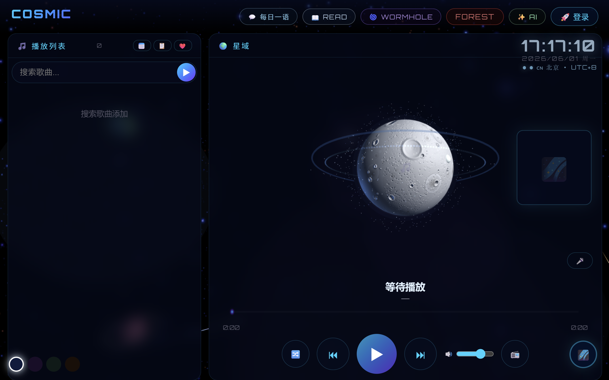
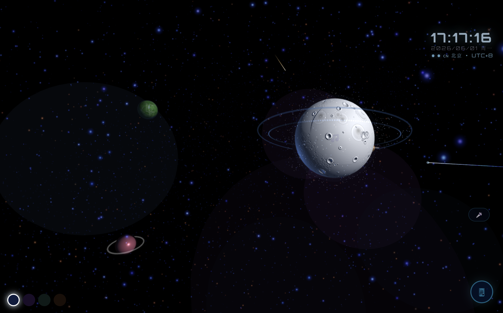
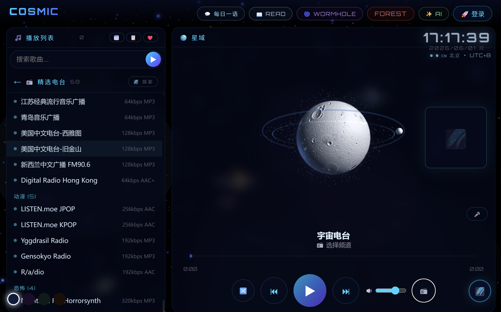
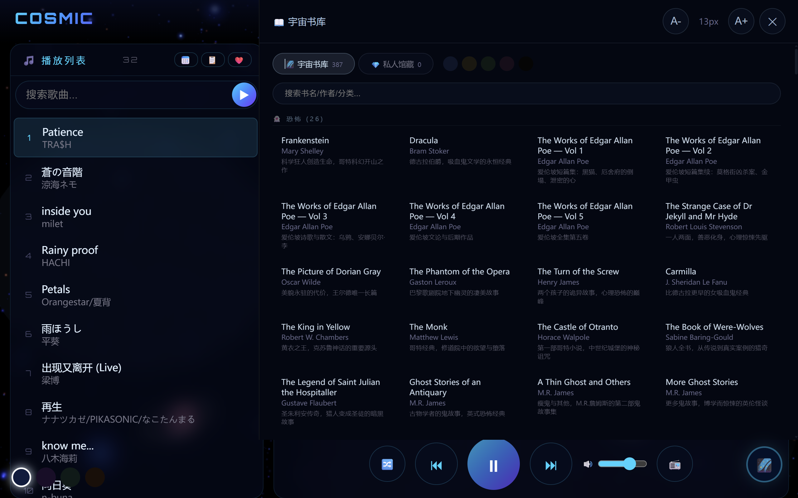
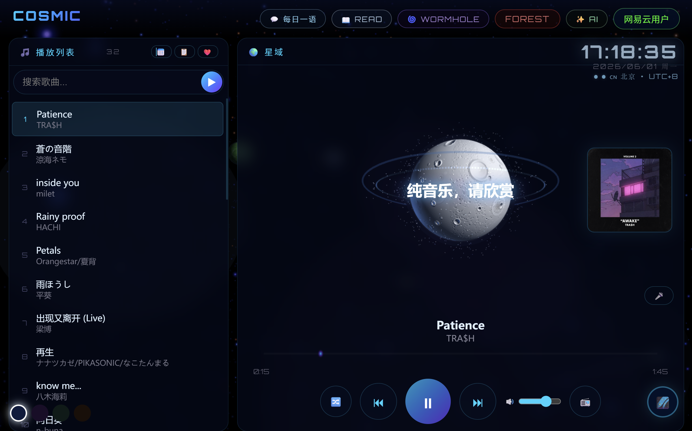
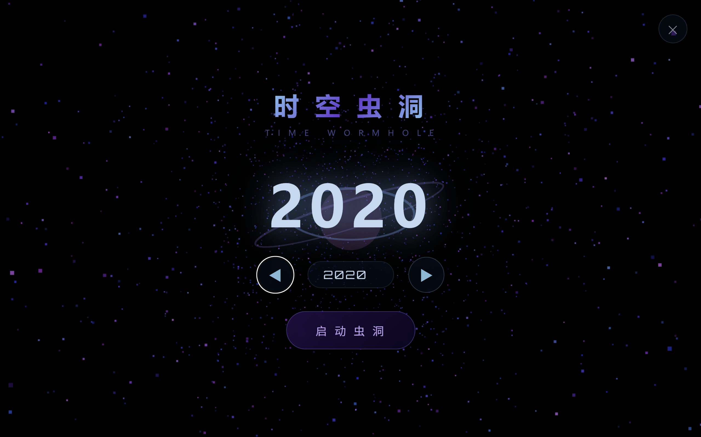
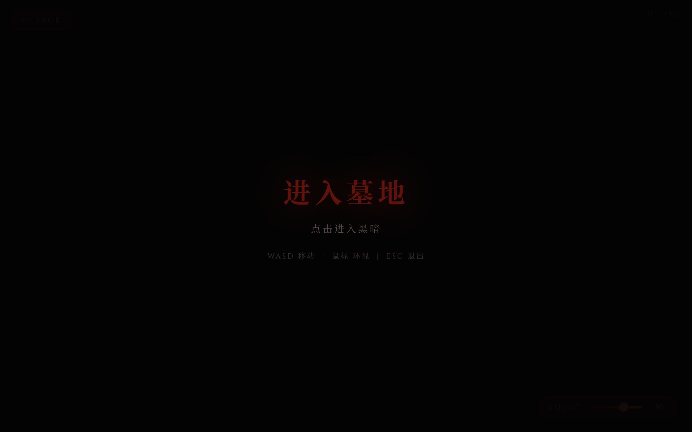
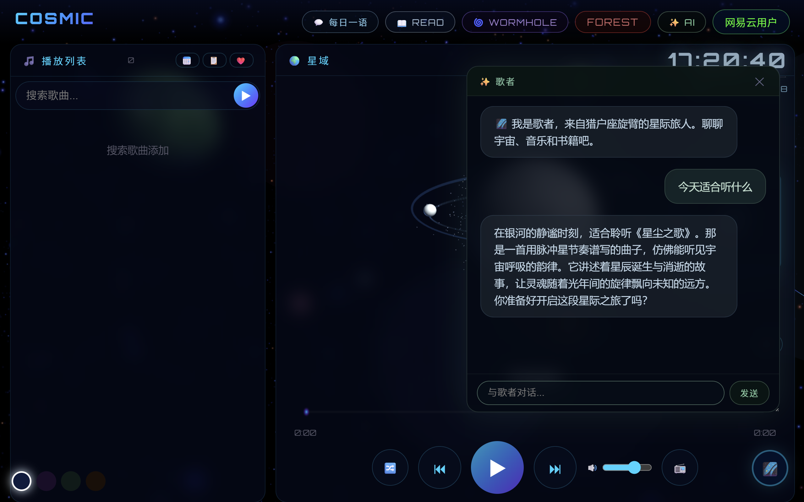
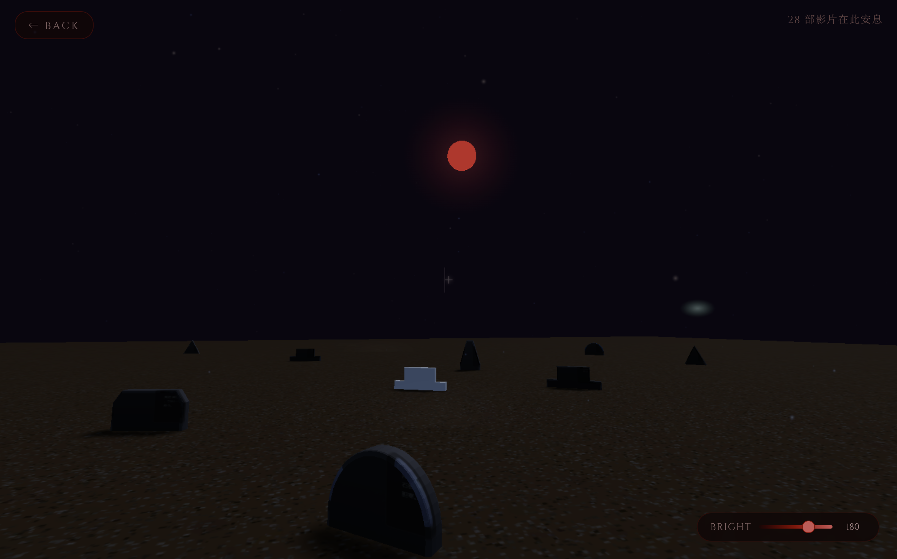

# 歌者空间 · SINGER SPACE

> 宇宙科幻音乐播放器 — 在星空间听歌、阅读、穿越时空

## 立即体验

**[singer-space.lat](https://singer-space.lat)**

*(Cloudflare Tunnel 永久域名，HTTPS 已生效)*

## 功能

| 模块 | 说明 |
|------|------|
| 星空 | Three.js 银河系粒子动态背景 |
| 音乐 | 网易云扫码登录，同步歌单/日推/喜欢 |
| 电台 | 68 个精选全球电台（含恐怖故事/暗黑氛围） |
| 书库 | 385 本公版书 + 本地书库，阅读进度保存 |
| 虫洞 | 1926-2025 时空穿越，电影/书籍/历史大事 |
| AI | 通义千问聊天，可拖拽悬浮窗 |
| 墓地 | B 站公版恐怖电影 |

## 本地运行

```bash
npm install
node server.js
# 访问 http://localhost:3000
```

## 技术栈

Express + Three.js + 网易云 API + 蜻蜓FM + Gutenberg + Cloudflare Tunnel

## 截图










